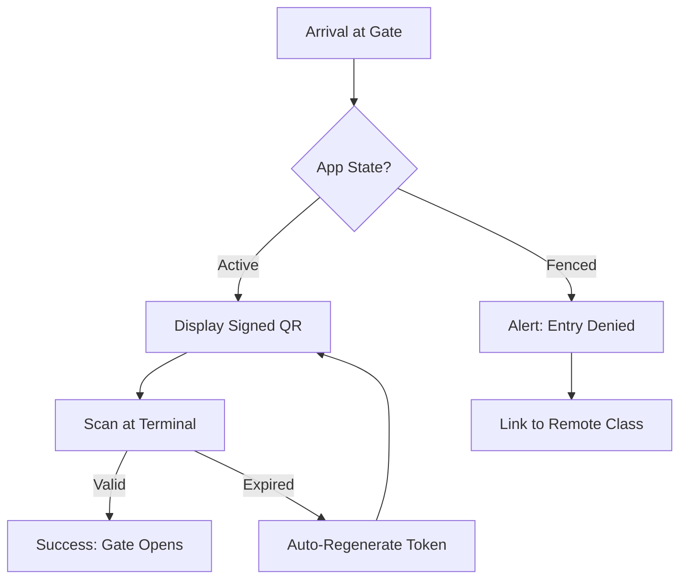
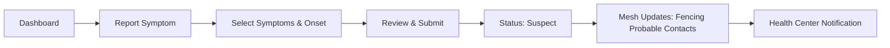
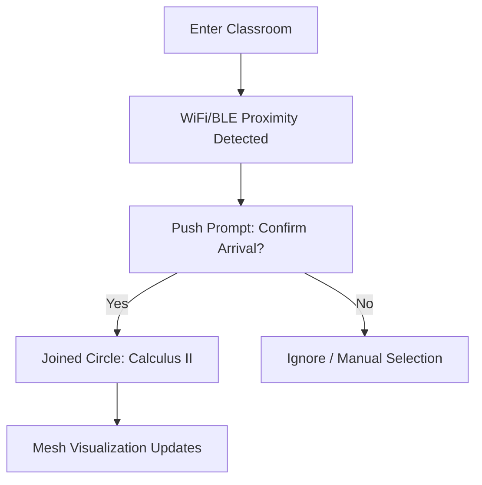

# UX Design Specification CircleGuard

**Author:** Juan
**Date:** 2026-03-19

---

<!-- UX design content will be appended sequentially through collaborative workflow steps -->

## Executive Summary

### Project Vision

A privacy-first contact tracing platform for university campuses that uses anonymous graph-based edge creation (WiFi/BLE/manual) to map contacts and apply proactive health fences instantly—without waiting for slow lab confirmations.

### Target Users

- **Students:** Primary mobile app users interacting with check-ins, questionnaires, and symptom reporting.
- **Faculty & Staff:** Users navigating room access and integration with LMS attendance.
- **Visitors/Providers:** Guest users utilizing web-based onboarding, who then smoothly transition to the native mobile app via **Local Authentication** (FaceID/TouchID) for sustained offline QR generation and accurate BLE tracing.
- **Health Center & Admin Staff:** Desktop users requiring data-dense dashboards for heatmap analytics, de-identification, and certificate review.

### Key Design Challenges

- **Frictionless Checking-In:** Students must be able to check into class circles with a single tap (or via automatic proximity prompts) without disrupting their day.
- **Visitor Mobile Handoff & Local Auth:** Designing a seamless funnel from visitor web-registration to the mobile app, enabling frictionless biometric re-authentication so visitors aren't bogged down by passwords at campus gates.
- **Privacy Trust & Anonymity:** The UI must visually reinforce that identities are completely protected, utilizing anonymous user codes and strict data framing.
- **Cross-Platform Parity:** Non-smartphone users need absolute feature set parity through the responsive web application.
- **High-Stress Workflows:** Reporting symptoms or receiving a "fence" notification is inherently stressful; the UX must guide users with extreme clarity and calm directness.

### Design Opportunities

- **Geospatial Hotspot Visualizations:** Providing administrators with visually commanding, instant heatmaps of symptomatic clusters dynamically across campus.
- **Ambient Intelligence:** Leveraging BLE and WiFi background UX to make the "sporadic contact" logic feel magical and non-intrusive rather than like surveillance.

## Core User Experience

### Defining Experience
The defining interaction of CircleGuard is the **Frictionless Status Check-in**. Whether a user is entering a building, joining a scheduled class, or verifying their health status, the system must validate their anonymous cryptographic identity instantly via QR code or background BLE/WiFi, minimizing physical bottlenecks at campus gates and classroom doors.

### Platform Strategy
- **Mobile App (iOS/Android):** The primary platform for Students, Faculty, Staff, and onboarded Visitors. Leverages native capabilities (BLE, WiFi scanning, Local Authentication/Biometrics, Push Notifications) to enable ambient contact tracing and offline entry tokens.
- **Responsive Web App:** A mandatory fallback designed for first-time Visitors, Providers, and users without smartphones. It provides full functional parity for manual circle creation, symptom reporting, and document uploads.

### Effortless Interactions
- **Background Proximity:** Users should not need to manually record every person they sit near; the BLE/WiFi cross-referencing should seamlessly register sporadic contacts without user intervention.
- **Biometric Web-to-App Handoff:** Visitors upgrading from the web to the mobile app should experience an automatic token transfer, securing their identity behind standard FaceID/TouchID effortlessly so they don't have to repeatedly type passwords.

### Critical Success Moments
- **The "Green Screen" Entry:** When a user approaches a campus checkpoint, scanning their rotating QR token must yield a visually distinct, instant "Green" (Active) state in under 200ms so students do not break their walking pace.
- **The Fence Notification:** If a user's status is promoted, the alert must be delivered with absolute clarity, detailing the *Why* and the exact *Next Steps* using calm, conversational terminology (e.g., "Important Health Update") rather than alarming internal database statuses.

### Experience Principles
1. **Privacy Above All Else:** Every UI element must reinforce anonymity (e.g., displaying an anonymous rotating avatar or hash rather than a real name).
2. **Zero-Friction Compliance:** If an interaction takes more than 5 seconds (like filling a daily health survey), users will bypass it. Make it dynamic, fast, and cached where possible.
3. **Calm Authority:** Health alerts and status changes must use authoritative but calming typography, structured formatting, and clear calls to action.
4. **Radical Transparency:** The UI must proactively explain exactly when and why it is scanning in the background, reassuring the user about battery impact to maintain trust.

## Desired Emotional Response

### Primary Emotional Goals
- **Safety & Trust:** Users should feel their data is completely secure and undeniably anonymous.
- **Relief & Clarity:** When checking their status or receiving instructions, they should feel informed rather than panicked.
- **Effortless Compliance:** They should feel like campus safety is automatic, requiring zero cognitive overhead.

### Emotional Journey Mapping
- **Discovery/Onboarding:** Skepticism turning into trust ("Oh, they really don't know my name, just this rotating QR code").
- **Daily Interaction (Check-ins):** Invisible and mundane ("I just scan and keep walking, it takes no time").
- **Status Change (Fenced):** Initial shock immediately buffered by structured clarity and support ("I know exactly what to do next and who to contact").
- **Resolution (Negative Test Upload):** Relief and empowerment ("I got my results back, I uploaded them, and my fence was instantly lifted").

### Micro-Emotions
- **Trust vs. Skepticism:** Proactively surfacing data retention policies (e.g., live 14-day auto-delete timers) builds massive trust.
- **Calm vs. Anxiety:** Avoiding harsh, aggressive alert colors (stark reds) in favor of authoritative but softer warning tones.
- **Confidence vs. Confusion:** The UI must prioritize absolute clarity in status states; a user should never wonder if they are allowed on campus.

### Design Implications
- **To build Trust →** Use cryptographically-styled avatars or hash strings rather than blank profiles. Place "Local Data expires in X days" badges prominently.
- **To avoid Anxiety →** Never use police or severe medical lockdown vernacular. Use phrasing like "Remote Learning Recommended" instead of "QUARANTINE MANDATED".
- **To foster Efficiency →** Provide massive, thumb-friendly tap-targets for the QR scanner and manual check-in buttons so they operate flawlessly while walking.

### Emotional Design Principles
1. **Never Alarm Unnecessarily:** System alerts should always be paired immediately with exact, actionable next steps.
2. **Invisible is Better:** The best emotional response to ambient contact tracing is not noticing it at all.
3. **Control Over Data:** Give users prominent, highly visible controls to view or purge their own temporal history, empowering them psychologically.

## UX Pattern Analysis & Inspiration

### Inspiring Products Analysis

**1. Apple Wallet / Google Pay (For Frictionless Entry)**
- **Core Problem Solved:** Identity and verification in under a second while walking.
- **Why it Works:** It relies entirely on Biometric Local Auth (FaceID/TouchID) to instantly unlock a monolithic, screen-dominating QR/barcode. 
- **The Magic:** Proximity surfacing. When near a terminal, the OS automatically brings up the credential without the user searching for the app.

**2. Citizen / Waze (For Hotspot Dashboarding)**
- **Core Problem Solved:** Displaying real-time danger/risk data geographically without causing panic.
- **Why it Works:** They use "Heatmap" style clustering that zooms out cleanly to show aggregated trends rather than pinpointing individual people.

**3. Uber / Lyft (For Ambient Workflows)**
- **Core Problem Solved:** Background proximity tracking that users actually want to leave on.
- **Why it Works:** Radical transparency. The app tells you exactly when it's tracking. Getting into the car automatically transitions the app state without manual check-ins.

### Transferable UX Patterns

**Navigation Patterns:**
- **"Single Action Home Screen":** Like Apple Wallet, the primary view of CircleGuard should be dominated by the Entry QR Code and current Health Status. No complex hamburger menus for the main flow.

**Interaction Patterns:**
- **Proximity-Triggered Prompts:** Like Uber, when a user enters a building via BLE beacon, their phone should ping with a single-tap "Check into Bio-Lab 101?" rich notification.

**Visual Patterns:**
- **Aggregated Heatmaps:** Like Waze, the Administrative Dashboard must cluster cases mathematically by building footprint, preventing individual device tracking while providing actionable safety data.

### Anti-Patterns to Avoid
- **The "Form-Heavy" Check-In:** Requiring users to type building names or descriptions to register a circle. Huge friction.
- **Persistent Surveillance Anxiety:** Using background processing without clear, friendly UI badges showing exactly what is being recorded.
- **Red Alert Panic:** Flashing the screen in harsh red colors when a user is flagged as `PROBABLE`. This induces panic. Use amber/mustard warning colors paired with structured next steps.

### Design Inspiration Strategy

**What to Adopt:**
- The Biometric-to-Token "Apple Wallet" flow for gateway scanning.
- The Waze-style clustered heatmap approach for the administrative reporting dashboard.

**What to Adapt:**
- Uber's proactive background tracking indicators, but strictly applying them to BLE/WiFi connections rather than GPS to maintain strict privacy.

**What to Avoid:**
- Complex deeply nested menus for symptom reporting or certificate upload. These must be 1-tap actions from the Home screen.

## Design System Foundation

### 1.1 Design System Choice
**Themeable System: NativeWind (Tailwind CSS) paired with Headless UI primitives.**

### Rationale for Selection
- **Cross-Platform Consistency:** CircleGuard requires both a native mobile app (iOS/Android) and a feature-equivalent Web Fallback. Tailwind CSS allows us to share design tokens (colors, typography, spacing) identically across both codebases using a single config file.
- **High Performance & Speed:** Following the "Under 200ms Green Screen Entry" UX requirement, a utility-first CSS framework minimizes styling overhead compared to heavy runtime UI libraries.
- **Brand Flexibility & Trust:** We need a calm, authoritative custom theme (soft blues, neutral slates). A Themeable System allows us to build this without fighting the strong visual opinions of a strict Established System (like standard Material Design).
- **Accessibility:** By pairing Tailwind with Headless UI libraries, we guarantee strict ARIA compliance and screen-reader support, which is mandatory for university compliance.

### Implementation Approach
- **Mobile Foundation:** Implement React Native with `NativeWind` to compile Tailwind classes to native style objects. 
- **Web Foundation:** React with Tailwind CSS and Radix UI (or similar) unstyled primitives.
- **Shared Tokens:** Create a monolithic design-token schema that acts as the single source of truth for all campus branding, warning states, and typography scales across both platforms.

### Customization Strategy
- **The "Calm Warning" Palette:** We will customize the default Tailwind palette, overriding standard "danger" reds with deep ambers or mustard yellows to communicate severity without inducing panic.

## 2. Core User Experience

### 2.1 Defining Experience

The defining interaction of CircleGuard is the **Frictionless Status Check-in**. Whether a user is entering a high-traffic campus gate or joining a lecture hall circle, the system must validate their anonymous cryptographic identity instantly. This interaction should feel like a "Magic Door"—access is granted because the system knows the user is safe, without requiring them to navigate complex menus or re-authenticate repeatedly.

### 2.2 User Mental Model

Users bring a mental model of **"Seamless Transactional Access"** (like Apple Wallet or a tap-to-pay transit card). They expect:
- **Zero Friction:** The app should be ready before they even reach the gate.
- **Predictability:** "If I'm Green, I'm good."
- **Privacy Assurance:** A visual confirmation that their real identity is never leaving their device during the handshake.

### 2.3 Success Criteria

- **The "Walking Pace" Benchmark:** Successful scan and validation in under 200ms.
- **Ambient Awareness:** Notification prompts for circle check-ins appear automatically upon entering room proximity.
- **Visual Clarity:** Immediate, high-contrast visual feedback (Green/Red) that is legible at a distance or in bright sunlight.
- **Offline Resiliency:** QR tokens are generated and valid even without active cellular data.

### 2.4 Novel UX Patterns

- **Proximity-Triggered Prompts:** Background BLE/WiFi monitoring that transitions to an active UI query only when a relevant "Circle" is detected.
- **Anonymous Hash Avatars:** Using abstract, unique geometric patterns derived from the anonymous hash to provide visual recognition without identity exposure.
- **Biometric Web-to-App Handoff:** An "Instant Upgrade" flow where visitors register on the web and seamlessly transfer their identity to the native app via FaceID/TouchID.

### 2.5 Experience Mechanics

1. **Initiation:** User approaches a checkpoint or enters a classroom. A proximity beacon pings the mobile app.
2. **Interaction:** User taps the notification or the "Quick Scan" widget on their lock screen. The app authenticates via biometrics and displays the signed QR token.
3. **Feedback:** The gate scanner provides a haptic pulse and a bright visual "Check" symbol. The phone displays a "Success" micro-animation.
4. **Completion:** The user continues their journey. The home screen status subtly pulses to show they are "Active" in their current circle.

## Visual Design Foundation

### Color System

The **"Stealth Privacy"** theme prioritizes a technical, high-security aesthetic to reinforce user trust in the system's resilience and data integrity.
- **Background:** Deep Zinc (#18181B / Zinc-900) to minimize display energy (mobile) and provide a sophisticated, non-intrusive backdrop.
- **Primary Action (Active):** Cyan (#0891B2 / Cyan-600) for check-ins and success states, communicating technical precision.
- **Accent/Alert (Fenced):** Safety Orange (#EA580C / Orange-600) for warnings and fence notifications, providing high visibility without the panic associated with medical reds.
- **Neutral/Surface:** Steel Gray (#475569) for secondary data cards and persistent UI elements.

### Typography System

- **Headings (Display):** **Outfit** (Variable Sans). A geometric typeface with modern terminal cuts, used for headings, health status badges, and brand identity.
- **Body (Functional):** **Inter**. Optimized for legibility at small sizes on mobile displays, used for instructions, data-dense dashboards, and system messages.
- **Scale:** An 8pt modular scale ensures consistent hierarchy across mobile and web platforms.

### Spacing & Layout Foundation

- **8px Base Grid:** All components, margins, and paddings are multiples of 8px to ensure a rigid, technical layout that feels engineered and reliable.
- **Density:** Medium-high density to allow for data-rich administrative dashboards while keeping the mobile "Status Home" clean and focused on a single monolithic action.
- **Card-Based UI:** Using subtle border or shadow separations on dark surfaces to group related information (e.g., Circle details, symptom reporting steps).

> [!TIP]
> **View Visual Foundation:** [visual-foundation.html](../design-assets/visual-foundation.html)

### Accessibility Considerations

- **High-Contrast Dark Mode:** Strict adherence to WCAG 2.1 AA (4.5:1 ratio) for all functional text against the Zinc-900 background.
- **Redundancy:** Status is never communicated by color alone; every "Active" (Cyan) or "Fenced" (Orange) state is accompanied by distinctive icons and text labels.
- **Touch Targets:** Minimum 48x48px interactive areas for all critical actions (Scan QR, Report Symptom) to accommodate one-handed mobile use.

## 3. Design Direction Decision

### 3.1 Design Directions Explored

We explored 6 visual variations within the "Stealth Privacy" theme, ranging from extreme status-focus ("The Pulse") to high-density utility ("Command Center") and geospatial awareness ("The Hotspot"). The discussion centered on balancing the urgency of the 200ms check-in with the strategic need to provide users with a sense of "Ambient Awareness" and trust in the system's privacy.

### 3.2 Chosen Direction: The Mesh

The selected direction is **"The Mesh"**. This approach surfaces the anonymized contact graph as a living, background data layer. It moves the user mental model away from "being monitored" toward "participating in a secure, local circle."

### 3.3 Design Rationale

- **Metaphorical Strength:** It visually reinforces the "Circle" concept, making the abstract cryptographic identity tangible through geometric connections.
- **Ambient Awareness:** It satisfies the success criteria for background monitoring, showing the user they are connected to their environment without requiring active UI deep-dives.
- **Stealth Aesthetic:** The technical, blueprint-like visualization of the mesh aligns perfectly with the high-security, privacy-first goals of the project.
- **Engagement:** It provides a subtle, dynamic background that makes the app feel "alive" and responsive to the user's physical presence on campus.

### 3.4 Implementation Approach

- **Canvas/SVG Rendering:** Use highly optimized, low-power background rendering for the mesh connections to ensure battery efficiency on mobile devices (addressing Winston's architectural concerns).
- **Cyan/Orange Integration:** Apply the Cyan-600 primary color to active, safe connections and Safety Orange-600 to transition nodes when a proximity fence is detected.
- **Interactive Friction:** Maintain the primary "Show Entry QR" action as a high-contrast floating button, ensuring the 200ms interaction benchmark is not compromised by the background visualization.

> [!TIP]
> **View Design Directions:** [ux-design-directions.html](../design-assets/ux-design-directions.html)

## 4. User Journey Flows

### 4.1 Frictionless Campus Entry
This flow is the primary daily interaction for all users. It must be executable in under 200ms to avoid gate congestion.

### 4.2 Symptom Self-Reporting
A high-trust journey where the user initiates the status promotion cascade. Requires empathy and immediate feedback.

### 4.3 Smart Proximity Check-in
The foundation of "The Mesh." Ambiently connects users to their class circles based on WiFi/BLE proximity.

### 4.4 Journey Patterns
- **Binary Success Feedback:** Every critical completion (Gate Green, Scan OK) uses the same Cyan-600 pulse and haptic feedback pattern.
- **Progressive Exposure:** Technical data (Anonymous ID, Token Hash) is hidden behind a "Security Details" toggle to avoid cluttering the primary user view.
- **Ambient Status:** The background mesh acts as a persistent indicator — if the mesh is Cyan, the user is safe to proceed.

### 4.5 Flow Optimization Principles
- **The 2-Tap Rule:** Any critical goal (Check-in, Report, Entry) must be reachable in no more than two taps from the dashboard.
- **OLED Efficiency:** Use pure black (#000000) for large background areas to maximize battery life on mobile devices during background monitoring.
- **Haptic Certainty:** Use distinct haptic vibration patterns for "Success" vs. "Action Required" to support eyes-free navigation at gates.

### 4.6 Professor Circle Dashboard
- **Layout:** Dedicated dashboard screen for active academic classes/circles (e.g., "Comunidad Prog6").
- **Header Details:** Date, Start/End Time, Circle ID, and Physical Space (Room).
- **Tab Navigation:** "COMUNIDAD" (general info) and "PARTICIPANTES" (attendees).
- **Metrics Bar:** Display counters for "Ingresados" (Checked-in), "Potenciales" (Expected), and "Aforo máximo" (Max Capacity).
- **Participant List:** Scrollable list showing user names with visual status indicators (e.g., Green checkmark for validated, Red 'X' for rejected or flagged).
- **Actions:** Prominent "NUEVO ASISTENTE" (New Attendee) primary button to manually add participants.
- **QR Display:** Option to display a large, scannable QR code on-screen for students to self-join the circle.

### 4.7 Sporadic Proximity Alert
- **Component:** Toast notification or persistent banner.
- **Trigger:** >15 minutes within <2 meters of an unregistered contact.
- **UI:** Unobtrusive warning text (e.g., "Extended proximity detected. Log interaction?") with an action button to quickly register the circle without revealing PII.

### 4.8 External User Registration
- **Flow:** Public landing page -> Registration Form (Visitor/Provider/Contractor selection) -> Data collection -> Account Verification -> Local DB Credential Generation.
- **Integration:** Web-to-App Handoff (UX-DR7) support for biometric linking after initial registration.

## 5. Component Strategy

### 5.1 Design System Components
We leverage **NativeWind (Tailwind CSS)** and **Headless UI** to ensure a performant, accessible foundation across Mobile and Web.

- **Layout:** Tailwind Flexbox/Grid for high-density dashboards.
- **Primitives:** Headless UI for Modals (Alerts), Switch (Privacy Settings), and Listbox (Circle Selection).
- **Typography:** Custom Outfit/Inter scales mapped to Tailwind text utilities.

### 5.2 Custom Components

#### The Mesh Background (Battery-Optimized)
- **Purpose:** Ambient status awareness.
- **Anatomy:** Zinc-900 or Pure Black (#000000) background with low-opacity SVG paths.
- **Interaction:** Strictly static or ultra-low frequency (once/30s) updates to preserve battery. Off-thread rendering via NativeWind.

#### Rotating QR Token
- **Purpose:** Secure, time-limited cryptographic entry validation.
- **Anatomy:** Centered QR code with a circular SVG countdown ring.
- **States:** Valid (Cyan), Warning/Expiring (Orange), Invalid (Gray).

#### Hash Avatar
- **Purpose:** Visual identity without personal data exposure.
- **Anatomy:** Simple geometric pattern generated from the user's salted anonymous hash.

### 5.3 Component Implementation Strategy
- **OLED Maximization:** Large backgrounds use pure #000000 to maximize battery life on modern mobile displays.
- **Zero-Wake Backgrounds:** Visual components (like the mesh) are completely disabled during background tracing, keeping the CPU/GPU idle.
- **Accessibility:** All status pulses are accompanied by distinct Haptic feedback and ARIA-compliant text labels.

### 5.4 Implementation Roadmap
1. **Phase 1 (Critical Gate Access):** Status Pulse Badge, Rotating QR Token, Primary Button.
2. **Phase 2 (Ambient Connection):** Static Mesh BG, Circle Preview Card, Hash Avatar.
3. **Phase 3 (Optimization):** Dynamic Symptom Questionnaires, Comprehensive Alert Overlays.

## 6. UX Consistency Patterns

### 6.1 Button Hierarchy
- **Primary (Monolithic):** Cyan-600 Background, White-100 Text. High-contrast, maximum tap target (48px+ height). Used for **"Show QR"** and **"Submit Report"**.
- **Secondary (Structural):** Steel Gray-500 Outline, Steel Gray-100 Text. Used for **"Cancel"**, **"View Details"**, or **"Edit Profile"**.
- **Tertiary (Minimal):** Ghost/Text-only. Used for **"Learn More"** or secondary navigation within settings.

### 6.2 Feedback Patterns
- **Success (Cyan Pulse):** 400ms Cyan-600 glow animation around the status badge + "Success" check icon and Haptic pulse.
- **Alert (Safety Orange Banner):** Top-anchored persistent banner with Safety Orange background and clear, calm instructions (e.g., "Remote learning recommended").
- **Syncing (Zinc Pulse):** Subtle, slow pulse of the Mesh nodes to indicate background data synchronization is active.

### 6.3 Form Patterns
- **Single-Column Only:** Never use multiple columns for inputs on mobile.
- **Micro-Forms:** Any system input (e.g., symptom checklist) should be limited to 5-7 items per screen to reduce cognitive load.
- **Progressive Disclosure:** Advanced settings (Mesh frequency, Privacy vault keys) are hidden behind "Show Advanced" toggles to prevent dashboard clutter.

### 6.4 Navigation Patterns
- **The "Home Anchor":** The central action on mobile is always the "Show QR" monolithic button, persistent regardless of sub-navigation state.
- **Tabbed Navigation (Mobile):** Status (Home), Circles (Graph), Reporting (Symptoms).
- **Contextual Side-Nav (Admin):** Hierarchical navigation for Building Heatmaps, User Management, and Policy Overrides.

## 7. Responsive Design & Accessibility

### 7.1 Responsive Strategy
- **Mobile-First:** The primary entry point for 90% of users. Monolithic actions and zero-distraction status views.
- **Desktop (Admin):** Utilizes large viewports to display side-by-side analytics (e.g., Campus Map + Confirmed Cases List).
- **Web Fallback:** Identical feature set for users without native apps, ensuring full functional parity.

### 7.2 Breakpoint Strategy
- **Mobile (Default):** < 640px. Single column, bottom-tab navigation.
- **Tablet (SM/MD):** 640px - 1024px. Hybrid layout with expanded lists and grid-based cards.
- **Desktop (LG):** > 1024px. Multi-column dashboard with persistent side-navigation.

### 7.3 Accessibility Strategy (WCAG 2.1 AA)
- **Contrast:** AA compliance for all text and interactive states.
- **Non-Text Content:** All icons and status indicators have corresponding aria-labels.
- **Touch Targets:** Minimum 48x48px for all critical mobile actions (Scan, Report).
- **Keyboard Navigation:** Full focus-trap management and skip-links for the Web and Admin dashboards.

### 7.4 Testing Strategy
- **Automated:** Integration of **Axe-core** for continuous accessibility auditing.
- **Manual:** Bi-weekly VoiceOver (iOS) and TalkBack (Android) audits of the core "Entry" and "Reporting" flows.
- **Visual:** Color-blindness simulations (Protanopia/Deuteranopia) to verify status readability.

### 7.5 Implementation Guidelines
- **Relative Units:** Use `rem` and `%` for all layout spacing to support system-wide font scaling.
- **Semantic Structure:** Native `Button`, `Text`, and `AccessibilityRole` primitives in React Native; Semantic HTML5 for Web.
- **Haptic Feedback:** Mandatory integration of native Haptic APIs for "Success" and "Error" states to support users with visual impairments.

